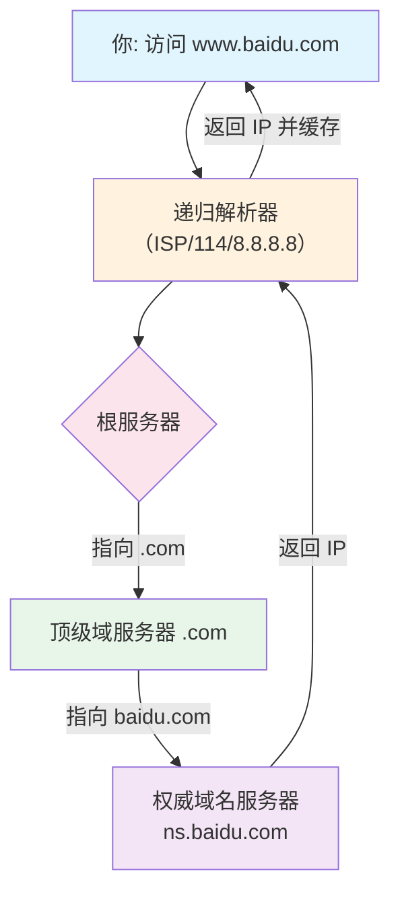

# Web基础

## 前端安全基础

为Web安全的重要组成部分,理解前端安全有助于发现漏洞和理解**攻击链**

**本质为**:攻击者利用浏览器对用户输入的处理机制,达到窃取数据,劫持会话或执行恶意操作的目的

### 三大安全机制

#### 1.同源策略

**同源策略**是浏览器最基础的安全机制。它规定：**只有协议、域名、端口都相同的页面，才能互相访问对方的资源**,即禁止页面加载与执行与自身不同源的任何脚本

不受同源策略影响的标签有: `<script src>` `` `<iframe src>` `<link href>`

**限制内容:**

- DOM访问
- XMLHttpRequest/fetch请求 (跨域请求被拦截)
- Cookie/LocalStorage/IndexDB访问

**跨域的解决方法**:

- CORS:服务端通过`Access-control-Allow-Origin`等响应头允许跨域请求
- JSONP:通过 `<script>` 标签跨域加载JSON数据
- postMessage*: HTML5 API,允许跨窗口安全通信

##### **postMessage:**

- 发送方:通过 `targetWindow.postMessage(data,targetOrigin)`向指定窗口派发**消息事件**
- 接收方:通过 `message`事件接收消息

#### 2.CORS (跨域资源请求)

当浏览器发送请求时,服务器通过返回特定的HTTP头来告诉浏览器是否允许跨域请求.

**核心响应头:**

| 响应头                             | 作用                          |
| ---------------------------------- | ----------------------------- |
| `Access-Control-Allow-Origin`      | 指定允许的源,可以说是具体域名 |
| `Access-Control-Allow-Methods`     | 允许的HTTP方法                |
| `Access-Control-Allow-Headers`     | 允许的自定义请求头            |
| `Access-Control-Allow-Credentials` | 是否允许携带Cookie            |

#### 3.CSP (内容安全策略)

CSP通过HTTP响应头 `Content-security-Policy` 告诉浏览器哪些资源可以加载和执行,有效防御XSS和数据注入

**常见指令:**

| 指令                 | 含义                                      |
| -------------------- | ----------------------------------------- |
| `default-src 'self'` | 默认只允许同源策略                        |
| `script-src 'self'`  | 只允许同源脚本(禁止内联<srcript>和<eval>) |
| `img-src` *          | 图片可以任意加载                          |

## 域名和DNS

DNS是一个简单的请求-响应协议,将域名和IP地址互相映射,默认使用TCP UDP的53端口

`ipconfig/displaydns`查询DNS记录

##### 域名系统工作原理

##### 相关的漏洞

- DNS劫持

  篡改DNS解析结果,把用户引到假的网站.

  - 修改路由器DNS

  - 本地Hosts文件被病毒修改

  - 中间人攻击篡改UDP响应包

- 拒绝服务

  耗尽服务器资源

  - 海量查询请求
  - 放大攻击,利用DNSSEC

  

## HTTP请求/响应

从安全角度看,HTTP有四个核心特点,每一个都直接关联特定的攻击面

1. **明文传输**:HTTP协议不加密数据,任何中间节点能看到请求和响应的全部数据,包括URL,Header,Body的敏感信息,**是中间人攻击和信息泄露的根本原因**
2. **无状态**:每次请求都为独立的,因此引入了**Cookie/Session**,通过 `Set-Cookie`响应头标识,客户端后续需携带**cookie**来证明身份,会导致 **会话劫持,XSS**等攻击
3. **请求响应模型**:客户端发起请求,服务端给出响应.攻击者可构造恶意请求探测服务器漏洞
4. **灵活可扩展:**HTTP允许自定义头部字段,方法等.

### HTTP请求方法

- **GET:获取数据**,参数通过URL传递,会被浏览器,代理,CDN缓存,且会保存在历史中
- **POST:提交数据**.参数在请求体中,不缓存,相对适合敏感操作,

|              | GET                         | POST                   |
| ------------ | --------------------------- | ---------------------- |
| URL可见性    | URL传参,通过?连接 &进行分割 | post将参数放在HTTP包内 |
| 传输数据大小 | URL最大2048个字符           | 无长度限制             |
| 后退页面     | 无影响                      | 重新提交               |
| 缓存         | 可被缓存,记录留在历史中     | 不可缓存               |
| 编码方式     | 支支持URL编码               | 支持多种               |
| 字符类型     | 只支持ASCII                 | 无字符限制             |

- **PUT*:***向服务器上传文件,配置不当可直接上传webshell
- **DELETE:**删除服务器资源
- **HEAD:**与GET类似,但服务器只返回响应头,常用来信息探测,而不会触发基于GET的日志记录
- **OPTIONS:**查询服务区支持哪些方法,攻击者可通过了解服务器功能
- **TRACE**:回显服务器收到的请求,用于调试,但可能引发XST跨站跟踪攻击,窃取用户Cookie
- **MOVE:**移动资源
- **CONNECT:**建立到目标资源的隧道,常用于SSL加密通信

### HTTP状态码

| 状态码                    | 含义(攻防视角)                                               |
| ------------------------- | ------------------------------------------------------------ |
| 200 OK                    | **成功**,一切正常                                            |
| 301/302重定向             | 常用于登陆后的**跳转**,如果 `Location`头指向攻击者控制的站点,可能构成开放重定向漏洞 |
| 400 Bad Request           | 请求语法有问题.可能在测试**SQL注入,XSS**时触发,构造的Payload扰乱了解析逻辑 |
| 401 Unauthorized          | 需要认证,是**权限绕过**测试的起点                            |
| 403 Forbidden             | 无权限,已经识别你但是拒绝访问,可能是**越权**的边界标志       |
| 404 NotFound              | 资源不存在,信息泄露的来源之一,可以进行**目录爆破和枚举**     |
| 405 Method Not Allowed    | **方法不被允许**,提示你可能需要其他方法进行攻击              |
| 500 Internal Server Error | **服务器内部出错**,通常攻击中意味着,你成功让服务器执行了异常操作,可能爆出文件或者数据库信息 |
| 502 Service Unavailable   | **服务器忙**,可能是DDos攻击,或服务器过载,爆破时出现可能是触发频率限制 |

### HTTP在安全中重要的请求头和响应头

#### 1.Host

- 作用:指定目标服务器/端口
- 漏洞:HTTP Host头攻击 (缓存污染,密码重置劫持,SSRF绕过)
- 注意:`Host`和`X-Forwarded-Host`的优先级问题

#### 2.Cookie和Set-Cookie

- 安全属性

  - HttpOnly 限制客户端获取cookie

  - Secrue 仅HTTPS传输

  - SameSite=Lax/Strict 防CSRF (Lax允许顶级导航,Strict 完全禁止)

  - Domain/Path 作用域限制

    

- 实战:拦截响应,若Set-Cookie 缺少任意属性,即可报告为中危

#### 3.Referer/Origin

- Referer:来源URL,可能泄露token或敏感参数
- Origin:仅含协议+域名+端口,更安全,CORS和CSRF防御首选
- 实战:
  - 测试CSRF时,检查后端是否校验`Referer`,尝试删除或置为null
  - 若`Referer`完全反射,可能泄露内网地址或授权码

#### 4.User-Agent

- 作用:客户端指纹
- 实战:
  - WAF绕过:将UA头伪装成Googlebot或者curl/wget
  - 识别老旧组件:如iPhone OS 9_3 为IOS9 

#### 5.X-Forwarded-For/X-Rea-IP

- 作用:传递真实IP
- 漏洞:IP伪造绕过黑白名单/频率限制
- 测试:添加 `X-Forwarded-For:127.0.0.1`尝试绕过
- 注意:后端若取 `X-Forwarded-For` 的第一个值,攻击者可以通过 `X-Forwarded-For: 127.0.0.1, 8.8.8.8` 注入伪造IP

#### 6.Content-type

-  请求的与实体对应的MIME信息
- 请求侧:文件上传漏洞关键标识
- 响应侧: 缺少或错误可能触发XSS

#### 7.Location

- 漏洞:开放重定向
- 测试:`Location: //evil.com`（协议相对URL）或`Location: /redirect?url=http://evil.com`

#### 8.Content-Security-Policy (CSP)

- 作用:限制资源加载源,防御XSS和数据注入
- 实战绕过:寻找CSP中的`unsafe-inline`、`data:`、`blob:`或CDN白名单（如`cdn.jsdelivr.net`），可能构造绕过

## Cookie/Session/Token机制

为什么需要他们?

- HTTP无状态,使服务器认识客户端,维持会话状态

### Cookie

#### 本质:

- 服务器通过 `Set-Cookie` 下发,浏览器自动存储并在后续请求中通过Cookie头携带
- 关键属性:
  - `Expires/Max-Age`:过期时间
  - `Domain/Path`:作用域
  - `Secure`:仅HTTPS传输
  - `HttpOnly`:禁止JS读取
  - `SameSite`:防止CSRF

#### 作为Session载体

- Cookie里存的是SessionID,而不是用户数据

### Session

#### 生命周期

1. 用户登录-服务端生成Session(存用户信息)-SessonID随Cookie返回
2. 请求到达-服务端根据SessionId查内存/Redis-反序列化获取用户信息

#### 存储位置

- 默认:服务器内存
- 生产环境:Redis

#### 缺点

- 耦合度高:服务器必须存状态,水平扩展需要共享存储
- CSRF漏洞:Cookie自动携带,容易受跨站请求伪造.

### Token

#### 核心思想

- 服务端不存,只负责验证和签发.客户端收到后自行保存(通常为LocalStorage或者Cookie)

#### JWT (JSON WEB Token)

- Header:算法
- Payload:用户ID,过期时间等(仅Base64编码)
- Signature:签名
- 优点:分布式天然友好,减轻DB压力,支持跨域
- 缺点:无法主动失效,体积大需要每次请求携带

#### 常见安全问题

1. **算法可修改为none**
2. **算法混淆(RS256--HS256)**:服务端使用非对称RS256,攻击者改为HS256对称加密,用公钥可做密钥签名
3. **密钥爆破**:使用若密钥签名HS356,可爆破出密钥伪造Token
4. **信息泄露:**仅Base64编码,可被直接解码查看敏感信息
5. **未验证签名:**服务端 未验证Signature,仅解析Payload

### 对比

| 维度     | Cookie (载体)     | Session(有状态)     | Token/JWT(无状态)                          |
| :------- | :---------------- | ------------------- | ------------------------------------------ |
| 存储位置 | 浏览器            | 服务端内存/Redis    | 客户端                                     |
| 状态     | 无状态载体        | 有状态              | 无状态                                     |
| 扩展性   | 依赖域名          | 分布式需要同步Redis | 天然水平扩展                               |
| 安全性   | 易受CSRF          | 依赖Cookie配置      | 防CSRF(不自动携带),若存LocalStorage不防XSS |
| 典型场景 | 记住登录,跟踪会话 | 传统MVC应用         | 微服务,移动端App,前后端分离                |