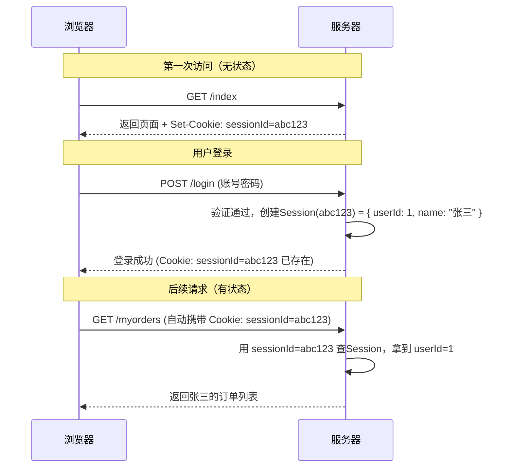

# JWT和HOST碰撞


## Session和Cookie


### HTTP 的“无状态”本质

HTTP 协议本身是**无状态**的。每次请求都是独立的，服务器处理完请求后就“失忆”了，不知道这次请求和上次请求是不是同一个人发的。

为了解决这个问题,**Cookie**和**Session**应运而生。


### Cookie

**Cookie**是服务器发给浏览器、并由浏览器保存的一小段文本数据（通常不超过4KB）。

**流程:**

1. **服务器下发:**用户登录后，服务器在响应头里加一个 `Set-Cookie` 字段

```http
Set-Cookie: username=zhangsan; Path=/; HttpOnly
```

2. **浏览器保存**:浏览器收到后,把这个键值对存在本地
3. **自动携带:**每次访问该网站,浏览器在请求头自动带上这个Cookie

**核心属性:**

| 属性                  | 作用                                       |
| :-------------------- | :----------------------------------------- |
| `Domain` / `Path`     | 控制 Cookie 在哪些域名和路径下生效         |
| `Expires` / `Max-Age` | 控制 Cookie 的生命周期（会话级 or 持久化） |
| `Secure`              | 仅允许通过 HTTPS 传输                      |
| `HttpOnly`            | **禁止 JavaScript 读取**（防XSS偷Cookie）  |
| `SameSite`            | 控制跨站请求是否携带（防CSRF）             |


### **Session**

**session**是服务器端存储用户状态的数据结构,它把用户的信息,(用户ID,权限,购物车等)保存在服务器内存或数据库中(Redis)中

**流程:**

1. **创建Session**:用户登陆后,服务器开辟一块空间,生成一个唯一的SessionID
2. **下发SessionID**:服务器通过 `Set-Cookie` 把 `sessionId=xxx` 发给浏览器（通常 Cookie 名为 `JSESSIONID` 或 `PHPSESSID`）。
3. **关联请求**:之后浏览器每次请求都自动带上这个 Cookie。
4. **查找Session**:服务器拿到 `sessionId`，去自己的存储里查找对应的用户数据

**区别:**

|                  | Cookie                           | Session                              |
| :--------------- | :------------------------------- | ------------------------------------ |
| **数据存储位置** | 浏览器端（客户端）               | 服务器端（内存/Redis/数据库）        |
| **大小限制**     | 小（约4KB）                      | 大（取决于服务器配置）               |
| **安全性**       | 低（数据暴露在客户端，可被篡改） | 高（数据在服务端，客户端只有一个ID） |
| **典型用途**     | 保存偏好设置、跟踪ID             | 保存登录态、用户信息                 |
| **生命周期**     | 由 `Expires` 控制                | 由服务器控制（通常较短，如30分钟）   |


## Cookie 与 Session 的协作关系

最常见的方案为:

**Cookie 存 Session ID，Session 存用户数据**



### 为什么Session更安全

- 用户的重要数据（如用户ID、权限）**从不离开服务器**，客户端只知道一个随机的 `sessionId`。
- 攻击者即使截获了 `sessionId`，也难以伪造用户身份（除非窃取整个Cookie，这就是 **Session劫持**）。
- 而如果把用户ID直接存在Cookie里，用户可以随意篡改（比如把 `userId=1` 改成 `userId=2`），服务器如果不做额外校验，就会出大问题。

### 会话劫持和会话固定

####  会话劫持（Session Hijacking）

攻击者通过各种手段，拿到了你当前有效的`Session ID`，然后用自己的浏览器带上这个ID，伪装成你直接操作。