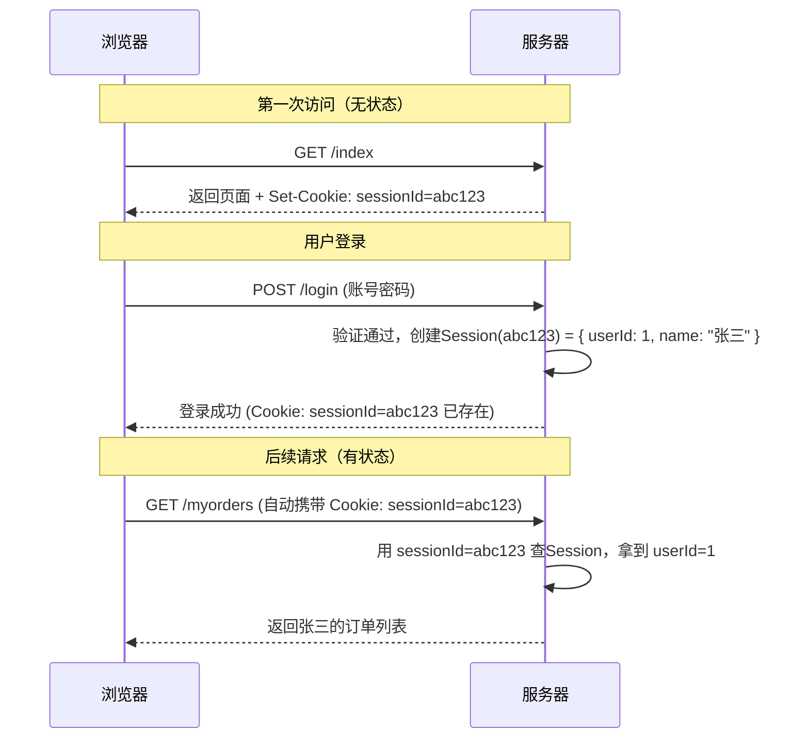

# JWT和HOST碰撞


## Session和Cookie


### HTTP 的“无状态”本质

HTTP 协议本身是**无状态**的。每次请求都是独立的，服务器处理完请求后就“失忆”了，不知道这次请求和上次请求是不是同一个人发的。

为了解决这个问题,**Cookie**和**Session**应运而生。


### Cookie

**Cookie**是服务器发给浏览器、并由浏览器保存的一小段文本数据（通常不超过4KB）。

**流程:**

1. **服务器下发:**用户登录后，服务器在响应头里加一个 `Set-Cookie` 字段

```http
Set-Cookie: username=zhangsan; Path=/; HttpOnly
```

2. **浏览器保存**:浏览器收到后,把这个键值对存在本地
3. **自动携带:**每次访问该网站,浏览器在请求头自动带上这个Cookie

**核心属性:**

| 属性                  | 作用                                       |
| :-------------------- | :----------------------------------------- |
| `Domain` / `Path`     | 控制 Cookie 在哪些域名和路径下生效         |
| `Expires` / `Max-Age` | 控制 Cookie 的生命周期（会话级 or 持久化） |
| `Secure`              | 仅允许通过 HTTPS 传输                      |
| `HttpOnly`            | **禁止 JavaScript 读取**（防XSS偷Cookie）  |
| `SameSite`            | 控制跨站请求是否携带（防CSRF）             |


### **Session**

**session**是服务器端存储用户状态的数据结构,它把用户的信息,(用户ID,权限,购物车等)保存在服务器内存或数据库中(Redis)中

**流程:**

1. **创建Session**:用户登陆后,服务器开辟一块空间,生成一个唯一的SessionID
2. **下发SessionID**:服务器通过 `Set-Cookie` 把 `sessionId=xxx` 发给浏览器（通常 Cookie 名为 `JSESSIONID` 或 `PHPSESSID`）。
3. **关联请求**:之后浏览器每次请求都自动带上这个 Cookie。
4. **查找Session**:服务器拿到 `sessionId`，去自己的存储里查找对应的用户数据

**区别:**

|                  | Cookie                           | Session                              |
| :--------------- | :------------------------------- | ------------------------------------ |
| **数据存储位置** | 浏览器端（客户端）               | 服务器端（内存/Redis/数据库）        |
| **大小限制**     | 小（约4KB）                      | 大（取决于服务器配置）               |
| **安全性**       | 低（数据暴露在客户端，可被篡改） | 高（数据在服务端，客户端只有一个ID） |
| **典型用途**     | 保存偏好设置、跟踪ID             | 保存登录态、用户信息                 |
| **生命周期**     | 由 `Expires` 控制                | 由服务器控制（通常较短，如30分钟）   |


## Cookie 与 Session 的协作关系

最常见的方案为:

**Cookie 存 Session ID，Session 存用户数据**


```mermaid
sequenceDiagram
    participant B as 浏览器
    participant S as 服务器

    Note over B,S: 第一次访问（无状态）
    B->>S: GET /index
    S-->>B: 返回页面 + Set-Cookie: sessionId=abc123

    Note over B,S: 用户登录
    B->>S: POST /login (账号密码)
    S->>S: 验证通过，创建Session(abc123) = { userId: 1, name: "张三" }
    S-->>B: 登录成功 (Cookie: sessionId=abc123 已存在)

    Note over B,S: 后续请求（有状态）
    B->>S: GET /myorders (自动携带 Cookie: sessionId=abc123)
    S->>S: 用 sessionId=abc123 查Session，拿到 userId=1
    S-->>B: 返回张三的订单列表
```

### 为什么Session更安全

- 用户的重要数据（如用户ID、权限）**从不离开服务器**，客户端只知道一个随机的 `sessionId`。
- 攻击者即使截获了 `sessionId`，也难以伪造用户身份（除非窃取整个Cookie，这就是 **Session劫持**）。
- 而如果把用户ID直接存在Cookie里，用户可以随意篡改（比如把 `userId=1` 改成 `userId=2`），服务器如果不做额外校验，就会出大问题。

### 会话劫持和会话固定

####  会话劫持（Session Hijacking）

攻击者通过各种手段，拿到了你当前有效的`Session ID`，然后用自己的浏览器带上这个ID，伪装成你直接操作。

##### **常见作案手法（偷的过程）**：

- **网络嗅探（中间人）**：如果你没用HTTPS，或者连了不安全的WiFi，攻击者在网络层抓包，直接从HTTP头里读出明文传输的`Cookie: sessionid=abc`。
- **XSS偷Cookie（最致命）**：如果Cookie没设置`HttpOnly`，攻击者注入的JS脚本执行`document.cookie`，直接偷走ID并发送到远程服务器。
- **跨站脚本读取本地存储**：有些开发者把Session ID存LocalStorage，XSS同样能偷。
- **木马/恶意浏览器插件**：直接从你浏览器文件里读取。

##### **经典攻击流程**：

1. 你登录银行，服务器下发`sessionid=A001`。
2. 恶意WiFi截获你的数据包，攻击者拿到`A001`。
3. 攻击者打开自己的浏览器，手动设置Cookie为`sessionid=A001`。
4. 攻击者刷新银行页面，**无需密码，直接以你的身份登录**。


##### 防御方式

- **全站HTTPS + HSTS**：堵死网络嗅探。
- **Cookie设置`HttpOnly`**（绝对不要用JS去读Session ID）：堵死XSS偷窃。
- **Cookie设置`Secure`**：确保ID只在加密通道传输。
- **IP或User-Agent绑定（辅助）**：服务端记录登录时的IP段，如果请求IP突然变了，强制要求重新认证。*（注：UA容易变，只能做风险提示，不能做死校验）*。


#### 会话固定

攻击者**不需要偷**你的ID，他**提前把自己的ID塞进你的浏览器**，骗你用这个ID去登录。等你登录成功后，服务端把这个ID认证成了“管理员”，攻击者拿着手里的备份ID，直接登录。

##### 常见作案手法

- **URL传参**：攻击者发链接给你：`http://bank.com/login?sessionid=ATTACKER_123`。如果你点击登录，且服务端允许URL参数作为Session ID，那么你的登录态就绑定在了`ATTACKER_123`上。
- **通过子域名/跨站写入Cookie**：利用子域名漏洞，通过`Set-Cookie`强行往你浏览器写一个已知ID。
- **``或`<a>`标签携带参数**。


##### **经典攻击流程**：

1. 攻击者自己访问银行网站，服务器给他发了一个Session ID，比如`abc456`（这是一个未登录的无效状态）。
2. 攻击者把包含这个ID的链接发给受害者：`https://bank.com/login?sessionid=abc456`。
3. 受害者点击链接，输入账号密码成功登录。服务器验证通过后，**直接将这个`abc456`标记为“已登录（管理员）”**（如果服务器没做强制重置的话）。
4. 攻击者立刻在自己的浏览器里访问银行，把Cookie里的Session ID改成`abc456`。
5. 攻击者直接进入了受害者的账户。


##### 防御方式

- **登录后强制刷新Session ID（Gold Standard）**：用户在提交登录请求（校验用户名密码通过后），服务器必须立即执行`session_regenerate_id()`（PHP）或`request.changeSessionId()`（Spring Security）。**以前的旧ID作废，生成一个全新的、攻击者永远不知道的新ID。**
- **禁用URL重写传递Session ID**：现代框架默认禁止从GET参数接收Session ID，只认Cookie头。


## JWT

### JWT的结构

**JWT**（JSON Web Token）是一个紧凑的、URL 安全的令牌格式，常用于身份认证和信息交换。

**核心结构**：由三部分组成，用点（`.`）分隔：

- **Header**（头部）：声明签名算法（如 HS256、RS256）和令牌类型。
- **Payload**（负载）：存放 Claims（声明），如用户 ID、过期时间。**不要存放密码等敏感信息**，因为它仅被 Base64Url 编码，并未加密。
- **Signature**（签名）：对前两部分用密钥签名，用于防篡改。

**常见使用场景**：

- **无状态认证**：用户登录后服务端返回 JWT，客户端（如 App、浏览器）后续请求携带它（通常在 `Authorization: Bearer <token>` 头），服务端验证签名即可识别用户，无需存储 Session。
- **单点登录 (SSO)**、API 防护、移动 App 授权。

**优点**：服务端无需存储 Session，易扩展；适合分布式系统。
**缺点**：令牌一旦签发，服务端无法主动使其失效（需配合黑名单或短过期时间+Refresh Token）；负载大小会影响传输效率。


### JWT鉴权

JWT鉴权就是服务端不存Session,全靠客户端每次请求带来的JWT令牌

**1. 登录签发（获得令牌）**
用户提交账号密码 → 服务端验证通过 → 生成JWT（包含用户ID和权限）返回。**关键**：服务端**不保存**这个令牌，只把密钥记在心里。

**2. 请求验证（出示令牌）**
客户端将JWT放在请求头的 `Authorization: Bearer <token>` 中发送。服务端拿到后，用密钥验证签名是否有效、时间是否过期，解析出用户ID后直接处理业务。

#### 与传统Session鉴权核心区别

| 对比维度       | **JWT鉴权（无状态）**              | **Session鉴权（有状态）**             |
| :------------- | :--------------------------------- | :------------------------------------ |
| **服务端存储** | **完全不存**，只靠密钥校验         | **必须存**在内存/Redis，查库开销大    |
| **水平扩展**   | **极其简单**，任意节点都能独立验证 | 需配置“粘性会话”或共享存储（如Redis） |
| **主动失效**   | **无法主动踢人**，只能等它过期     | 直接删Session，**立即失效**           |
| **性能开销**   | 签名验证需CPU计算（尤其RS256）     | 内存/Redis查询，CPU开销小             |


### 为什么用JWT

#### 传统Session认证


1. 用户在浏览器输入用户名和密码，服务端通过校验后，生成一个session保存到服务端

2. 服务器为用户生成SessionID,并将其响应给客户端浏览器放置在Cookie中，在后续请求进行携带

3. 当客户端发起请求后，会携带Cookie，服务端获取Cookie中的SessionID，进行对比是否有效。


##### 问题?

1. 每个用户经过我们服务端认证后，我们的应用都要在服务端做一次记录/存储，以方便下一用户请求的鉴别，通常而言，Session都是保存在内存中，而随着认证用户的增多，服务端的开销会明显增大。

2. 用户认证之后，服务端做认证记录，如果认证记录被保存在内存中的话，这意味着用户下次请求还**必须要求在这台服务器上**，这样才能拿到授权的资源，这样在分布式的应用上，限制了负载均衡的能力。限制了应用扩展能力。

3. 因为是基于Cookie来进行用户识别，Cookie如果被截获，用户就会很容易收到csrf
4. 在前后端分离系统中就更加痛苦：如下图所示:

也就是说前后端分离在应用解耦后增加了部署的复杂性。通常用户一次请求就要转发多次。如果用Session每次携带sessionid到服务器，服务器还要查询用户信息。同时如果用户很多。这些信息存储在服务器内存中，给服务器增加负担。还有就是CSRF（跨站伪造请求攻击），session是基于cookie进行用户识别的，cookie如果被截获，用户就会很容易受到跨站请求伪造的攻击。还有就是sessionid就是一个特征值，表达的信息不够丰富。不容易扩展。而且如果你后端应用时多个节点部署。那么就需要实现session共享机制，不方便集群应用。


### JWT认证


#### 认证流程

1.  首先前端通过Web表单将用户名和密码发送给后端的接口，这一过程一般为post请求。建议的方式为HTTPS协议，从而避免敏感信息被嗅探。
2. 后端核对用户名和密码成功后，将用户的ID等其他信息 作为JWTPayload（负载），将其与头部分别进行Base64编码拼接后签名，形成一个 JWT（Token） 。
3. 后端将JWT字符串作为登录成功的返回结果返回给前端。前端可以将返回的结果保存到`LocalStorage`或`SessionStorage`上，退出登录时前端删除保存的JWT即可。
4. 前端每次请求时，会将JWT放置 HTTP Header 中的 `Autorization` 位（解决XSS和CSRF问题）
5. 后端收到前端请求后，会检查是否存在，如存在则验证JWT的有效性，例如，检查签名是否正确；检查Token是否过期；‘检查Token的接收方是否是自己。
6. 验证通过后，后端使用JWT中包含的用户信息进行其他逻辑操作，返回相应的结果。


#### 优势

1. **简洁**：可以通过URL ，POST参数或在HTTP Header发送，因为数据量小，传输速度也很快。

2. **自包含** ：负载中包含了所有用户所需要的信息，避免了多次查询数据库。

3. 因为Token是以JSON格式保存在客户端的，所以JWT是跨语言的，**原则上任何Web形式都支持**。

4. 不需要再服务端保存会话信息，特别适用于**分布式微服务**。


#### session和jwt的区别

**区别**： 后端将JWT字符串作为登录成功的返回结果返回给前端。前端可以将返回的结果保存在localStorag或sessionStorage上，退出登录时前端删除保存的JWT即可。

**安全性**： JWT的Payload使用的是Base64编码的,因此JWT不能存储敏感数据。而session再服务端存储，相对来说安全。

**优缺点**： JWT保存在客户端，在分布式环境下不需要做额外工作。而session因为保存在服务端，分布式环境下需要实现多机数据共享 session一般需要结合Cookie实现认证，所以需要浏览器支持cookie，因此移动端无法使用session认证方案


### JWT安全问题


##### 敏感信息泄露


#### 无签名(none算法)

#### 暴力破解密钥